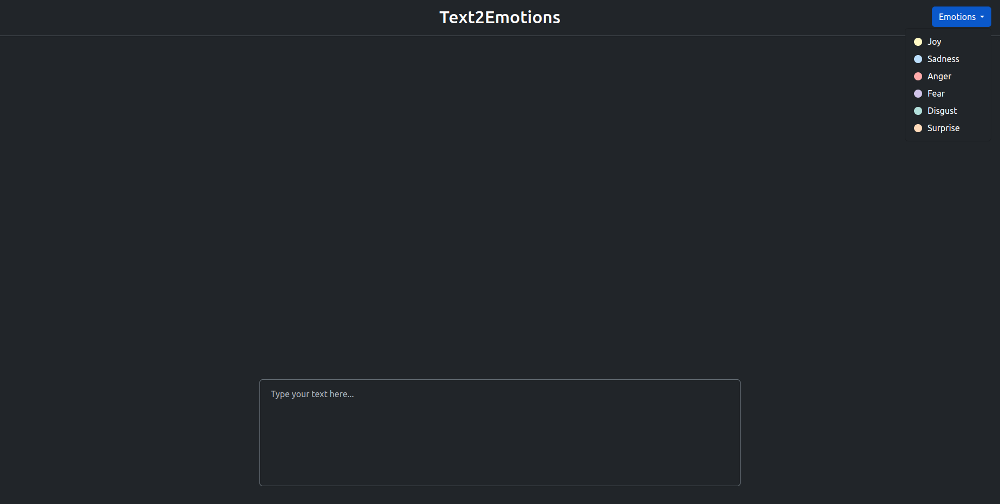
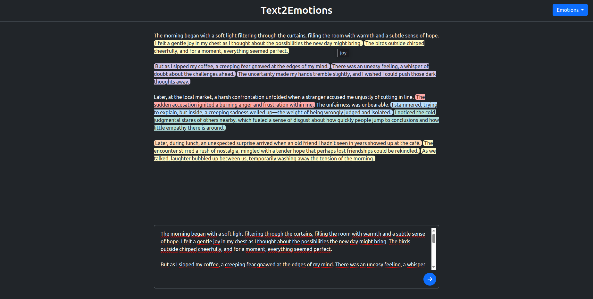

# Text2Emotions

**Text2Emotions** is a prototype system that performs sentence-level emotion analysis and presents the results in a clean, interactive web interface. The system consists of a backend API that detects emotions in English text and a frontend interface for user interaction and visualization.

## Features

- Sentence-level emotion detection using a transformer-based NLP model
- Web interface with color-coded emotion highlights
- Easy-to-use API with automatic documentation
- Dockerized deployment for both frontend and backend

## Architecture

The project is divided into two main components:

| Component | Description |
|----------|-------------|
| [`backend/`](./backend/) | FastAPI application providing an emotion analysis API using a pre-trained Hugging Face model |
| [`frontend/`](./frontend/) | Angular web app that interacts with the backend and displays results visually |

## Tech Stack

- **Python 3.10+** - For the backend
- **FastAPI** – RESTful API framework
- **Transformers** + **Torch** – For Emotion classification
- **Angular** –  For the frontend application
- **Bootstrap** + **FontAwesome** – Styling and UI icons
- **Docker** – Containerization and deployment

## Running the Project

Make sure you have [Docker](https://www.docker.com/) and [Docker Compose](https://docs.docker.com/compose/) installed.

From the root of the project (`Text2Emotions/`), run the following command:

```bash 
docker compose up --build
```

This will:

- Build and start the **backend** on `http://localhost:8000`
- Build and start the **frontend** on `http://localhost:8080`

Once the containers are running, open your browser and go to:

`` http://localhost:8080 ``

> **Important**: The **backend** may take a while to start on the first run, because it downloads and loads the Hugging Face model into memory.
> Make sure to **wait for the backend logs to confirm it is ready** before using the app.

## Screenshots

#### Home Page View


#### Emotion Detection Example


> The example text in the second screenshot was generated by ChatGPT.

## Notes

- The emotion model is designed for English text only; using other languages may result in inaccurate predictions.
- This version does not yet support responsive design — media queries and mobile optimizations are not included.

## License

This project is licensed under the MIT License - see the [LICENSE](LICENSE) file for details.